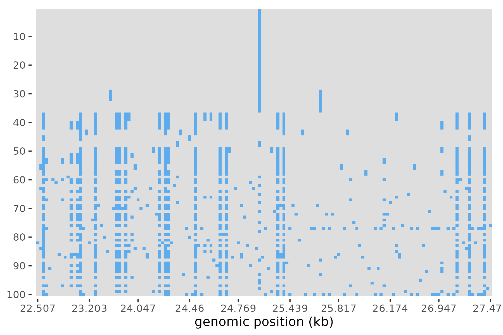

# Haplotype Visualizer

This repo provides an R script to construct 'haplotype plots' 
of genetic variation in a genomic window, using delimited files or numpy arrays of genetic variants.

## A more detailed description

We require input data files common to the Garud lab, which we call "haplotype" 
files. These look like:

| site_pos | site_type | sample1 | sample2 | sample3 |
|---|---|---|---|---|
| 10 | syn | 0 | 1 | 0 |
| 22 | nonsyn | 0 | 0 | 1 |
| 35 | noncoding/NC | 0 | 0 | 1 |
...

The samples may be named arbitrarily, but the "site_pos" column is required (for now), 
and genomic positions are plotted on the x axis. Other metadata columns (e.g. site_type) 
are optional, but must be specified (common Garud lab metadata cols are automatically ignored). 

Alternatively, a raw numpy array (or series of arrays) of 0s and 1s may be passed in,
matching the structure seen above, and with no metadata columns. 
||||
|---|---|---|
| 0 | 1 | 0 |
| 0 | 0 | 1 |
| 0 | 0 | 1 |


## What's required

Environment dependencies: 
* R (4.3.3) (or other modern R versions)
* R Packages (tidyverse):
    * dplyr
    * ggplot2
    * readr
    * magrittr 
    * tidyr
* other R Packages:
    * argparse

* If using numpy files:
    * RcppCNPy OR
    * reticulate

## Usage 

```{bash}
Rscript hap_plot.R -h


usage: hap_plot.R [-h] -f PATH [-o PATH] [--sort_method SORT_METHOD]
                  [--window START END] [-i IMAGE_INDEX] [--annotate]
                  [--palette PALETTE] [--expanded_region START END]
                  [--nonsample_cols [NONSAMPLE_COLS ...]] [--width WIDTH]
                  [--height HEIGHT] [--polarize_to_minor]

General use haplotype plotting script

options:
  -h, --help            show this help message and exit
  -f PATH, --file PATH  input file name (should be .tsv, .csv, or .npy).
  -o PATH, --out PATH   output file name; extension should be one of '.png'
                        '.jpeg' '.pdf'
  --sort_method SORT_METHOD
                        sorting method: 'none', 'frequency', or 'distance'
  --window START END    window region to plot / cluster haplotypes by
  -i IMAGE_INDEX, --image_index IMAGE_INDEX
                        Image batch index. Required for .npy
  --annotate            annotate WINDOW region in plot
  --palette PALETTE     how to color minor alleles: 'default' or 'site_type'
                        ('site_type' column must be in input.)
  --expanded_region START END
                        expanded region to plot (and not cluster by)
  --nonsample_cols [NONSAMPLE_COLS ...]
                        non-sample columns (space separated). Commonly used
                        columns for our lab (e.g. contig, gene_id) are
                        automatically included.
  --width WIDTH         output figure width
  --height HEIGHT       output figure height
  --polarize_to_minor   polarize minor alleles to 1, major alleles to 0
```

## Examples


### Basic haplotype plot

In the plot window, samples with matching haplotypes are clustered together, with
haplotypes plotted by descending frequency, by default. Blue denotes the "1" alleles 
in the data set (in this case, minor alleles).

```{bash}
./hap_plot.R -f example_data/hard_sweep.tsv \
             -o example_data/hard_sweep.png \
             --window 22500 27500
```




### Expanded region haplotype plot

Haplotypes are clustered in the window, but nearby regions are also plotted for 
comparison. The red rectangle denotes the region in which clustering was performed. 

```{bash}
./hap_plot.R -f example_data/hard_sweep.tsv \
             -o example_data/hard_sweep_expanded.png \
             --window 22500 27500 \
             --expanded_region 20000 30000 \
             --annotate
```


### site_type palette haplotype plot

If the site_type column is included, "1" alleles are colored by their site_type identity, 
either synonymous ("syn", blue), non-synonymous ("nonsyn", red) and noncoding ("NC" or "non_coding", orange) identity. 


```{bash}
./hap_plot.R -f example_data/hard_sweep.tsv \
             -o example_data/hard_sweep_colored.png \
             --window 22500 27500 \
             --palette site_type
```


### Distance sorting haplotype plot

With this option, samples with matching haplotypes are clustered together, but 
plotted by the genomic distance to the most frequent haplotype, such that the 
haplotype most diverged from the most frequent is plotted last.

```{bash}
./hap_plot.R -f example_data/hard_sweep.tsv \
             -o example_data/hard_sweep_distsort.png \
             --window 22500 27500 \
             --palette site_type \ 
             --sort_method distance
```


## Developers

* Brendan Aeria (aeriab)
* Peter Laurin (peterlaurin)

Feel free to submit a pull request or raise an issue on GitHub!


Brendan Uses this for numpy files:
Rscript hap_plot.R --file hard_sorted_color.npy --image_index -2 --out ./my_haplotype_folder --sort_method 'none'
